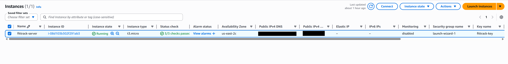
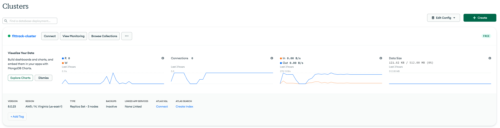
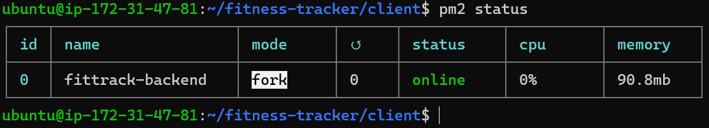
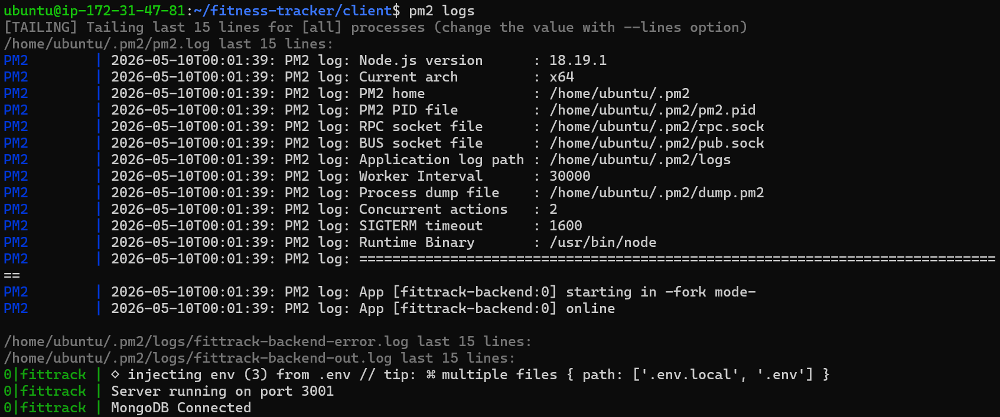
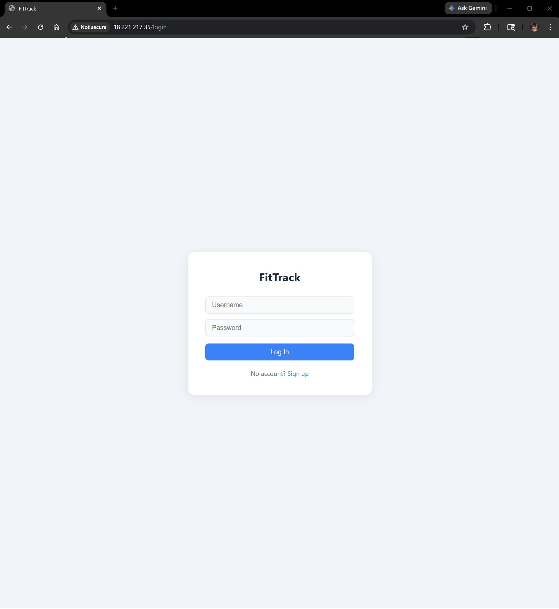
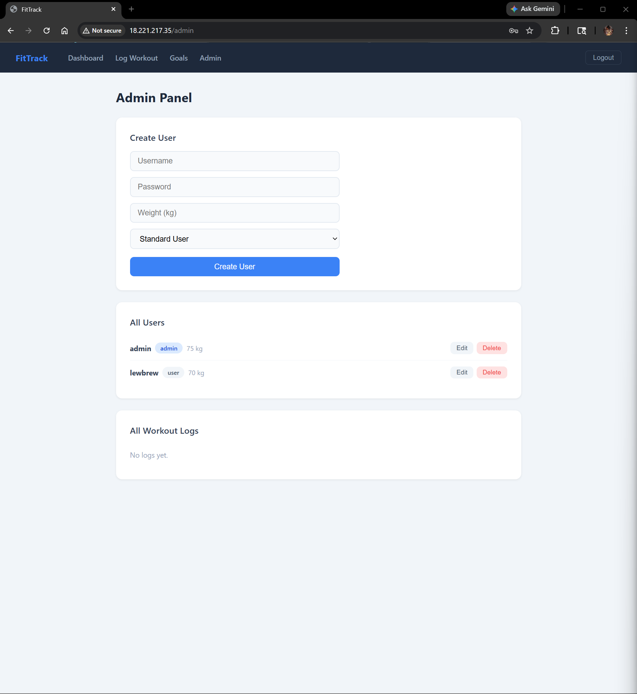

# FitTrack AWS Cloud Deployment

A cloud-deployed version of the FitTrack MERN fitness tracking application hosted on AWS EC2. This repository focuses on deploying, configuring, and managing the application in a Linux cloud server environment using Nginx, PM2, and MongoDB Atlas.

Original FitTrack application repository:

https://github.com/LewBrew/fitness-tracker

---

# Project Overview

This project demonstrates deploying a full-stack MERN application to the cloud using AWS infrastructure and Linux server configuration tools.

The focus of this repository is cloud deployment, server management, and production-style hosting rather than application feature development.

---

# Cloud Deployment Features

- AWS EC2 Ubuntu Server Deployment
- SSH Key Authentication
- React Frontend Production Build
- Express Backend Hosting
- Nginx Reverse Proxy Configuration
- PM2 Process Management
- MongoDB Atlas Cloud Database
- Public Web Hosting
- Linux Server Administration
- Environment Variable Configuration

---

# Tech Stack

## Cloud / Infrastructure

- AWS EC2
- Ubuntu Linux
- Nginx
- PM2
- SSH

## Frontend

- React
- Vite
- React Router

## Backend

- Node.js
- Express.js
- Mongoose
- JWT Authentication

## Database

- MongoDB Atlas

---

# Deployment Architecture

```text
User Browser
      ↓
    Nginx
      ↓
React Frontend + Express Backend
      ↓
MongoDB Atlas
```

---

# Deployment Process

## 1. Provisioned AWS EC2 Instance

Created an Ubuntu EC2 instance and configured security group rules for:

- SSH
- HTTP
- HTTPS
- Application traffic

---

## 2. Connected Through SSH

Connected securely using a `.pem` SSH key.

Example:

```bash
ssh -i fittrack-key.pem ubuntu@your-ec2-ip
```

---

## 3. Installed Server Dependencies

Installed:

- Node.js
- npm
- Git
- Nginx
- PM2

---

## 4. Configured MongoDB Atlas

Connected the backend to a cloud-hosted MongoDB Atlas cluster using environment variables.

---

## 5. Built React Frontend

Created a production frontend build using:

```bash
npm run build
```

---

## 6. Configured Nginx

Configured Nginx to:

- Serve the React frontend
- Route API requests to the Express backend
- Support frontend routing

---

## 7. Managed Backend with PM2

Used PM2 to:

- Keep the backend running persistently
- Restart automatically on crashes
- Start automatically after server reboot

---

# Screenshots

## AWS EC2 Instance



---

## MongoDB Atlas Cluster



---

## PM2 Backend Status



---

## PM2 Application Logs



---

## Login Page



---

## Admin Dashboard



---

# Difference From Original FitTrack Repository

The original FitTrack repository focuses on application development and MERN stack functionality such as:

- authentication
- workout tracking
- goal tracking
- admin functionality
- MongoDB schemas
- frontend UI

This repository focuses specifically on cloud deployment and infrastructure management:

- AWS EC2 hosting
- Linux server setup
- PM2 process management
- Nginx configuration
- MongoDB Atlas integration
- public deployment configuration

---

# Security Notes

Sensitive files are excluded from this repository:

- `.env`
- `.pem` SSH keys
- MongoDB credentials
- connection strings
- `node_modules`

---

# Skills Demonstrated

- AWS EC2 Deployment
- Linux Server Administration
- Nginx Reverse Proxy Setup
- PM2 Process Management
- Cloud Database Integration
- MERN Stack Deployment
- SSH Configuration
- Environment Variable Management
- Production Hosting Workflow
- Full-Stack Cloud Deployment

---

# Future Improvements

- HTTPS / SSL Certificate
- Custom Domain Name
- Docker Containerization
- CI/CD Pipeline
- AWS Load Balancer
- CloudWatch Monitoring
- Improved Frontend Error Handling

---

# Related Repository

Original FitTrack MERN Application:

https://github.com/LewBrew/fitness-tracker
